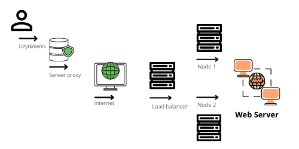
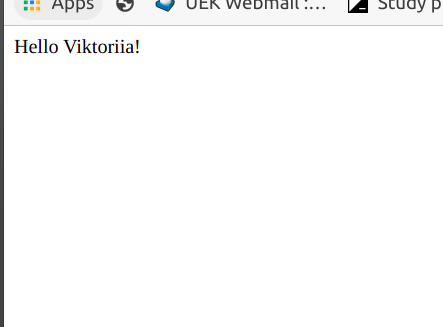

# Instalacja aplikacji 

- Instalacja python i git
- Synchronizacja repozytorium 
- Stworzenie użytkownika i nadanie uprawnień
- Stworzenie virtual environment
- Instalacja zależności
- Restart https

## Infrastruktura sieciowa

## App

